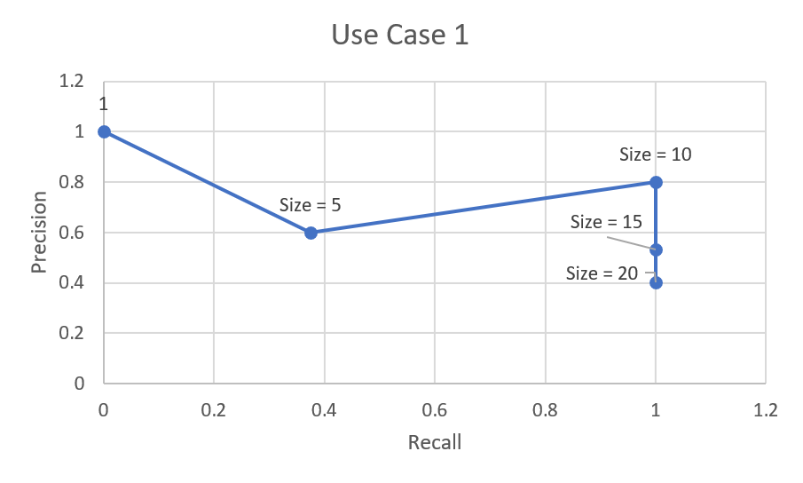

#INFO 624 Final Project
##<b>Group 16</b>:
Edmar Pareño: erp75@drexel.edu
Jenn Zoriel De Vera: jnd73@drexel.edu
##Project Type: Search Engine Building


##1. Report

<blockquote><h4>Why:</h4> Due to tons of options, people who are new to anime may find difficult to search for the particular anime to watch. In fact, in 2018 it has been reported that there are already almost 14,000 anime created. The wide collection of genre may cause people to find it difficult finding suitable anime based on their taste. The search engine the group has built serves as a tool for retrieving information specifically for Anime domain. This search engine also has a recommendation system which can be very useful in retrieving series of related anime based on the selected anime.</blockquote>

<blockquote><h4>What:</h4> Our datasets are from Kaggle. The main dataset consists of 1563 instances and 20 fields. These data fields consist of basic information of the anime such as the type, number of episodes, airing date, studio, producer, rating, description, etc. The 21st field of our data is the image url from another dataset concatenated to the main dataset. Some have no images because of the difference in size between the two datasets.


</blockquote>

<blockquote><h4>Who:</h4> Anime is not just for those who like the Japanese culture. The myriad choices of genre allow for this form of entertainment to cater to a broader audience. The many options, however, can also pose difficulty in searching for the anime suited to the user's preference. Thus, this search engine will allow new and old users to search for animes that they like by searching for keywords. This search engine can also filter genres to specific themes that the user like to watch and get the animes that exhibit these themes. A recommender is also implemented so that similar to the chosen anime will be shown for consideration.<br>
<blockquote><h5>Use Cases:</h5>
    <ol>
    <li><b>Quick Search:</b> Users should be able to retrieve animes based on the keyword/s inserted. Keyword/s inserted will be matched to Title and Description.</li>
    <li><b>Advance Search:</b> Users should be able use the search filters to refine the result by categories such as genres, type, minimum rate and airing date. In addition, result can be sorted by relevance or score/rating.</li>
    <li><b>Recommender:</b> In order to explore new animes, the recommendation system will provide series of related anime based on the chosen anime. The result will greatly rely on the anime's genre and studio.</li>
    </ol>

</blockquote>
</blockquote>

<blockquote><h4>How:</h4>

##### 1. Data Field Description
Title and Description both contain enough information about the anime itself. English analyzer is also applied for these two to include stemming. Stemming allows for the words to be reduced to their root form, thus words will be better queried. Type, Status, Starting season, Broadcast time, Producers, Licensors, Studios, Sources, Genres, Duration, and Rating are all text fields that are specific. Thus, these fields are set to standard analyzer since stemming will not impact the query on these fields too much. Start airing and End airing are both datetime and will be used to filter the anime. Episodes, Score, Scored by, and	Members are integer fields. Since rank_feature can not be used for sorting, only	Favorites was set to rank_feature since this field is proportional to the number of users that like the anime. The anime_img is a url, thus set as text without any analyzer.
<br>


##### 2. Use Case Description
###### UseCase 1 Query (Quick Search)
```json
"query": {
            "multi_match": {
            "query": "Naruto",
            "fields": [
                "Title^3", "Description"
            ],
            "fuzziness": "AUTO"
            }
          }
```
<b>Description:</b> This query will display all relevant animes based on the keyword inserted. Keywords should contain partial title and/or description of the target anime, since the query is going to match the keywords to the data set's title and description. This search query will be give more weight to the title compared to description in terms of relevance scoring. The query also implements a fuzzy query such that incorrectly spelled keywords can still be searched. User would want to query anime recommended by peers using this quick search. This works best when the user know the keywords related to the anime or the title itself. Minor misspelling will be accommodated by the fuzzy query functionality. This way when user types the wrong keyword, they can still be given results closest to their query terms.


###### UseCase 2 Query (Advance Search)
```json
        "query": {
          "bool": {
            "must": [
              {
                "multi_match": {
                  "query": "Action, Fantasy, Romance TV",
                  "type": "cross_fields",
                  "fields": [
                    "Genres",
                    "Type"
                  ],
                  "operator": "and"
                }
              }
            ],
            "filter": [
              {
                "range": {
                  "Start_airing": {
                    "gte": "2010-01-01"
                  }
                }
              },
              {
                "range": {
                  "Score": {
                    "gte": 7
                  }
                }
              }
            ]
          }
        },
        "sort": [
          {
            "Score": {
              "order": "desc"
            }
          }
        ]
```
<b>Description:</b> The query above uses multimatch with cross_fields to check if the terms are present in one of fields (Genre and Type). The results are filtered using the date field (Start_airing) and minimum rating (Score). Results are then sorted by score or relevance. This supposes that user would want anime that share their preferences and would like to give results based on those preferences. If user wants an anime that has sci-fi and adventure themes with supernatural powers, they would want to query sci-fi, adventure, and supernatural. They can also limit the year of airing and score to have specific results.


###### UseCase 3 Query (Recommender)
```json
"query": {
  "bool": {
    "must":
      {
        "multi_match":{
          "query": "Action,Adventure,Comedy,Super Power,Martial Arts,Shounen Studio Pierrot",
          "fields": [
              "Genres^2",
              "Studios"
            ]
        }
      },
      "must_not":
        {
          "match": {
            "Title": {
              "query": "Naruto",
              "operator": "or"
            }
          }
        }
  }
}
```

<b>Description:</b> A simple multimatch is used for this case which queries from the genres and studios fields. The genres field is boosted to give more importance on similar anime in terms of genre. The selected anime will not be in the results. This allows for users that previously watched an anime to be recommended with an anime that is similar. If for instance, an anime that a user watched is a sci-fi, adventure, and supernatural anime made by Studio Pierrot, the user will be recommended with anime of the same genre and then anime from the same studio even if sharing only some of the genres with the previously watched anime. This way users can be recommended with anime of the same genre class and/or anime from the same studio.


##### 3. Similarity, Scoring, and boosting methods.

|Fields| Similarity/Boosting | Rationale |
|------|------------|-------------|
|Title, Description |my_dfr      | DFR assumes that a document contains more information for when the frequency of a term diverges greatly from its frequency in the collection.            |
|Favorites| rank_feature| Implements rank_feature in this field so that it can boost relevance score. The group feels that Favorites field must be a factor for scoring and ranking as the higher the numerical value of it suggest that it is one of the most beloved and/or popular anime.   |
|Genres, Type, Studios|Boolean     |Implements Boolean similarity to these fields in order to serves as categories in filtering anime. Results basing on these boolean fields will have strict implementation in terms of evaluation as anime must fulfills all specified areas. The group thinks that genre, anime type, and studios are important fields for users to consider in searching animes. |

</blockquote>


<b>Data Field Mapping</b>
```json
{
  "erp75_info624_201904_project_anime5" : {
    "mappings" : {
      "properties" : {
        "Broadcast time" : {
          "type" : "text",
          "similarity" : "boolean",
          "analyzer" : "standard"
        },
        "Broadcast_time" : {
          "type" : "text",
          "fields" : {
            "keyword" : {
              "type" : "keyword",
              "ignore_above" : 256
            }
          }
        },
        "Description" : {
          "type" : "text",
          "similarity" : "my_dfr",
          "analyzer" : "english"
        },
        "Duration" : {
          "type" : "text",
          "similarity" : "boolean",
          "analyzer" : "standard"
        },
        "End airing" : {
          "type" : "date",
          "format" : "yyyy-MM-dd"
        },
        "End_airing" : {
          "type" : "date"
        },
        "Episodes" : {
          "type" : "integer"
        },
        "Favorites" : {
          "type" : "rank_feature"
        },
        "Genres" : {
          "type" : "text",
          "similarity" : "boolean",
          "analyzer" : "standard"
        },
        "Licensors" : {
          "type" : "text",
          "similarity" : "boolean",
          "analyzer" : "standard"
        },
        "Members" : {
          "type" : "integer"
        },
        "Producers" : {
          "type" : "text",
          "similarity" : "boolean",
          "analyzer" : "standard"
        },
        "Rating" : {
          "type" : "text",
          "similarity" : "boolean",
          "analyzer" : "standard"
        },
        "Score" : {
          "type" : "integer"
        },
        "Scored by" : {
          "type" : "integer"
        },
        "Scored_by" : {
          "type" : "text",
          "fields" : {
            "keyword" : {
              "type" : "keyword",
              "ignore_above" : 256
            }
          }
        },
        "Sources" : {
          "type" : "text",
          "similarity" : "boolean",
          "analyzer" : "standard"
        },
        "Start airing" : {
          "type" : "date",
          "format" : "yyyy-MM-dd"
        },
        "Start_airing" : {
          "type" : "date"
        },
        "Starting season" : {
          "type" : "text",
          "similarity" : "boolean",
          "analyzer" : "standard"
        },
        "Starting_season" : {
          "type" : "text",
          "fields" : {
            "keyword" : {
              "type" : "keyword",
              "ignore_above" : 256
            }
          }
        },
        "Status" : {
          "type" : "text",
          "similarity" : "boolean",
          "analyzer" : "standard"
        },
        "Studios" : {
          "type" : "text",
          "similarity" : "boolean",
          "analyzer" : "standard"
        },
        "Title" : {
          "type" : "text",
          "similarity" : "my_dfr",
          "analyzer" : "english"
        },
        "Type" : {
          "type" : "text",
          "similarity" : "boolean",
          "analyzer" : "standard"
        },
        "anime_img" : {
          "type" : "text"
        }
      }
    }
  }
}

```

<blockquote><h4>How Good:</h4>
<h5>Use Case 1 (Quick Search)</h5>

|Top # Hits| Precision|Recall|
|----------|----------|------|
|  0         |   1.0      |  0.0     |
|  5         |   0.6      |  0.375     |
|  10        |   0.8     |  1     |
|  15         |   0.533      | 1     |
|  20         |   0.4      |  1     |


    The precision-recall graph for use case 1 shows the best performance at size 10. The recall for this size is already 1 which means all the relevant anime were shown in the results. The precision is also the highest at 0.8 which suggests that non-relevant anime are retrieved less than that of relevant animes. Increasing the size of the results showed no change in recall because it is already at maximum and does not go down as size goes up, however, precision drops gradually.

<h5>Use Case 2 (Advance Search)</h5>
This use case is a filter function that allows the user to search for anime using the genre and type. This kind of function allows for the user to query anime based on their preferences; romance, supernatural, sci-fi, etc. Since this function is a filter type, evaluation will be based on its usefulness and not on other metrics. The query was action, fantasy, and romance TV series that started airing on Jan 1, 2010 with minimum score of 7, sorted in descending order. The results of this search were pretty decent results in terms of the query. All the anime in the result were good recommendations for viewers looking for anime with genre similar to the query. Therefore, the advance search function is very useful when looking for anime that share the same genre with the user-preferred genre and type.

<h5>Use Case 3 (Recommender)</h5>

$DCG_2$ = $rel1 + \sum_{i=2}^p rel_i/log_2(i)$
= $rel_1 + rel_2/lg(2) + rel_3/lg(3) + ... + rel_i/lg(i)$
=  $ 1 + 1/1 + 1/1.6 +  1/2 + 0/2.3$
= $ 3.125 $

The selected anime was Naruto. The result included 4 season of Dragon Ball which we deem as relevant. The Dragon Ball franchise share the same quality of comedic themes with the selected anime. The fifth one was not similar to the other results because of the opposite reason as above, this anime does not have comedic themes, thus irrelevant. 4 out of the 5 results are relevant to the selected anime giving a high DCG value of 3.125.

</blockquote>

<blockquote><h4>Where:</h4> Index: erp75_info624_201904_project_anime5</blockquote>

<blockquote><h4>Experiences:</h4>
<b>What works?</b><br>
The group thinks that adding a fuzziness to the query of use case 1 (Quick Search) makes it more reliable than the other use cases. This is because of all the use cases, the use case 1 allows room for error and can still perform good. Query terms need not be perfect for this use case to work, instead it gives results based on the closest it can find in the index.
<br>

<b>What doesn't works?</b>
It may seem strange, but the sorting doesn't work on the use case 2 (Advance Search). When the group tried to make it in ascending order,  the result starts with a lower value, but instead of the scores increasing, it still in decreasing order.<br>

<b>What could have done better?</b>
The group thinks that the use case 2 (Advance Search Query) could have been done better. Currently, it is like this query only displays the top list of anime of the specified genre. It could be better to have another field for anime's name/keywords, just like the other anime search engine that the group has reviewed/visited. <br>

<b>What have you learned as a team?</b>
Firstly, having this kind of collaborative group project, the group has learned how to efficiently break down complex tasks and assign them within the group. As a team, the group also learned how to check and evaluate each other's work to ensure that there will be no lacking description. On the practical side of the project, as a group, we have learned how to implement numerous methods such as boosting, filtering, and sorting in a query. In addition, the group also becomes more familiar with Flask <br>

<b>Future Works</b>
For future works, the group thinks of having an additional use case like a query for related anime; this may seem similar to the third use case, but instead of getting anime which has a similar genre and studio, this 4th use case will be for anime that has associated anime such as another season and special episodes. The group is also considering adding another field as rank_feature field for future works; the group thinks it is insufficient to only have favorites as an additional factor in scoring. Furthermore, the group also wants to enhance the current user interface as right now; there is no interface for the recommender. <br>


</blockquote

##2. Code and Interface

###Homepage Interface:


###Results: Interface:


